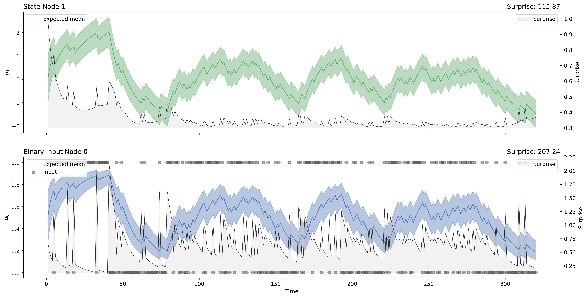

[](https://github.com/pre-commit/pre-commit) [](https://github.com/LegrandNico/metadPy/blob/master/LICENSE) [](https://travis-ci.com/LegandNico/ghgf) [](https://codecov.io/gh/LegrandNico/ghgf) [](https://github.com/psf/black) [](http://mypy-lang.org/) [](https://pycqa.github.io/isort/)

# The multilevel, generalized and nodalized Hierarchical Gaussian Filter for predictive coding

**GHGF** is a Python library that implements the generalized and nodalized Hierarchical Gaussian Filter in Python. It is built on the to of [JAX](https://jax.readthedocs.io/en/latest/jax.html) and [Numba](http://numba.pydata.org/) and can easily be embedded in any [PyMC](https://www.pymc.io/welcome.html) probabilisic model for MCMC sampling.

## Getting started

### Installation

The latest release of **HGF** can be installed from the GitHub folder:

`pip install “git+https://github.com/ilabcode/ghgf.git@ecg”`

### How does it works?

The Hierarchical Gaussian Filter consists of a hierarchy of interdependent nodes that are being updated after observing input data. The value of a node depends on the value of its value and volatility parents. A node is formally defined as a Python tuple containing 3 variables:

1. A `parameter` dictionary containing the node parameters (value, precision and parameters controlling the dependencies from values and variability parents).
2. A value parent (optional).
3. A volatility parent (optional).

[Figure1](./docs/source/images/genmod.svg)

Value parent (`vapa`) and volatility (`vopa`) parent are nodes themself and are organized following the same principle.

The node structure consists of nodes embedding other nodes hierarchically (i.e. tuples embedding other tuples). A generalization of the standard Hierarchical Gaussian Filter can build a hierarchical structure containing an arbitrary number of nodes, inputs and non-linear transformation between nodes. The structure continues as long as a given node has value or volatility parents. Well-known special cases of such hierarchies are the 2-level and 3-level Hierarchical Gaussian Filters.

### Example

Fitting a continuous 3 levels HGF model on a time series.

```python
from numpy import loadtxt
from ghgf.model import HGF
from ghgf import load_data
import jax.numpy as jnp

# Load time series example data
timeserie = load_data("continuous")

# Format input data and add a time vector 
data = jnp.array(
    [
        timeserie, 
        jnp.arange(1, len(timeserie) + 1, dtype=float)
        ]
    ).T

# This is where we define all the model parameters - You can control the value of
# different variables at different levels using the corresponding dictionary.
hgf_model = HGF(
    n_levels=3,
    initial_mu={"1": 1.04, "2": 1.0, "3": 1.0},
    initial_pi={"1": 1e4, "2": 1e1, "3": 1.0},
    omega={"1": -13.0, "2": -2.0, "3": -2.0},
    rho={"1": 0.0, "2": 0.0},
    kappas={"1": 1.0, "2": 1.0},
)

```

`
Fitting the continuous Hierarchical Gaussian Filter (JAX) with 2 levels.
`

```python
%%timeit
jaxhgf.input_data(input_data=data)
```

`
3.08 ms ± 104 µs per loop (mean ± std. dev. of 7 runs, 1 loop each)
`

Get the surprise associated with this model.

```python
jaxhgf.surprise()
```

`
DeviceArray(-1922.2267, dtype=float32)
`

Plot the beliefs trajectories.

```python
jaxhgf.plot_trajectories()
```



## Tutorials

You can find detailled introduction to different version of the Hierarchical Gaussian Filter applied to binary or continuous dataset in the following notebooks:

| Notebook | Colab | nbViewer |
| --- | ---| --- |
| Binary HGF | [](https://colab.research.google.com/github/ilabcode/ghgf/raw/ecg/notebooks/1-Binary%20HGF.ipynb) |  [](https://nbviewer.jupyter.org/github/ilabcode/ghgf/raw/ecg/notebooks/1-Binary%20HGF.ipynb)
| Continuous HGF | [](https://colab.research.google.com/github/ilabcode/ghgf/raw/ecg/notebooks/2-Continuous%20HGF.ipynb) |  [](https://nbviewer.jupyter.org/github/ilabcode/ghgf/raw/ecg/notebooks/2-Continuous%20HGF.ipynb)
| Hierarchical HGF | [](https://colab.research.google.com/github/ilabcode/ghgf/raw/ecg/notebooks/3-HierarchicalHGF.ipynb) |  [](https://nbviewer.jupyter.org/github/ilabcode/ghgf/raw/ecg/notebooks/3-HierarchicalHGF.ipynb)

# Acknoledgements

This implementation of the Hierarchical Gaussian Filter was largely inspired by the original [Matlab implementation](https://translationalneuromodeling.github.io/tapas). A Julia implementation can be found [here](https://github.com/ilabcode/HGF.jl).

## References

1. Mathys, C. (2011). A Bayesian foundation for individual learning under uncertainty. In Frontiers in Human Neuroscience (Vol. 5). Frontiers Media SA. https://doi.org/10.3389/fnhum.2011.00039
2. Mathys, C. D., Lomakina, E. I., Daunizeau, J., Iglesias, S., Brodersen, K. H., Friston, K. J., & Stephan, K. E. (2014). Uncertainty in perception and the hierarchical Gaussian filter. Frontiers in Human Neuroscience, 8. https://doi.org/10.3389/fnhum.2014.00825
3. Powers, A. R., Mathys, C., & Corlett, P. R. (2017). Pavlovian conditioning-induced hallucinations result from overweighting of perceptual priors. Science (New York, N.Y.), 357(6351), 596–600. https://doi.org/10.1126/science.aan3458
