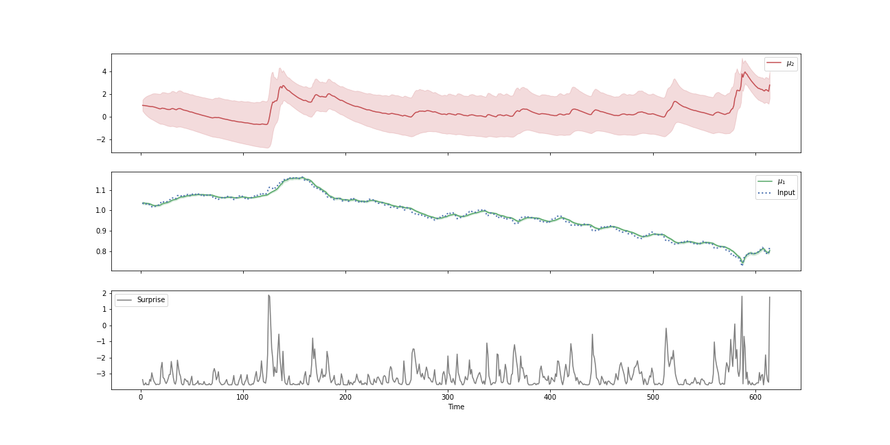

[](https://github.com/pre-commit/pre-commit) [](https://github.com/LegrandNico/metadPy/blob/master/LICENSE) [](https://travis-ci.com/LegandNico/ghgf) [](https://codecov.io/gh/LegrandNico/ghgf) [](https://github.com/psf/black) [](http://mypy-lang.org/) [](https://pycqa.github.io/isort/)

---

# The multilevel, generalized and nodalized Hierarchical Gaussian Filter for predictive coding

This repository implements the generalized and nodalized Hierarchical Gaussian Filter in Python and [JAX](https://jax.readthedocs.io/en/latest/jax.html). This refactoring offers two advantages:
1. it offers significant performance improvement as compared to pure Python code.
2. it makes the model function itself differentiable in a way that optimization can be performed using e.g MCMC sampling and the model can be embedded as a log probability function in Hierarchical Bayesian models e.g using [Numpyro](https://num.pyro.ai/en/latest/index.html#introductory-tutorials).

> **Note:** This branch is a fork of the generalized and nodalized HGF repository and is mainly developed by Nicolas Legrand from the ECG lab (Aarhus University). It is still largely experimental.

---

# Tutorials

> Under construction

| Notebook | Colab | nbViewer |
| --- | ---| --- |
| Binary HGF | [](https://colab.research.google.com/github/ilabcode/ghgf/raw/ecg/notebooks/1-Binary%20HGF.ipynb) |  [](https://nbviewer.jupyter.org/github/ilabcode/ghgf/raw/ecg/notebooks/1-Binary%20HGF.ipynb)
| Continuous HGF | [](https://colab.research.google.com/github/ilabcode/ghgf/raw/ecg/notebooks/2-Continuous%20HGF.ipynb) |  [](https://nbviewer.jupyter.org/github/ilabcode/ghgf/raw/ecg/notebooks/2-Continuous%20HGF.ipynb)
| Hierarchical HGF | [](https://colab.research.google.com/github/ilabcode/ghgf/raw/ecg/notebooks/3-HierarchicalHGF.ipynb) |  [](https://nbviewer.jupyter.org/github/ilabcode/ghgf/raw/ecg/notebooks/3-HierarchicalHGF.ipynb)

# Getting started
## Pure Python code

Example of surprise minimization on a continuous input using the pure Python implementation.

```python
import os
from numpy import loadtxt
from ghgf.hgf import StandardHGF

# Load time series
timeserie = loadtxt("./test/data/usdchf.dat")

stdhgf = StandardHGF(
    n_levels=2,
    model_type="GRW",
    initial_mu={"1": 1.04, "2": 1.0},
    initial_pi={"1": 1e4, "2": 1e1},
    omega={"1": -13.0, "2": -2.0},
    rho={"1": 0.0, "2": 0.0},
    kappas={"1": 1.0},
)
```
`
Continuous Hierarchical Gaussian Filter
... Initializing a 2 levels perceptual HGF using a GRW model.
`

```python
%timeit
stdhgf.input(timeserie)
```
`
6.81 ms ± 22.6 µs per loop (mean ± std. dev. of 7 runs, 100 loops each)
`

## JAX backend
  
```python
from ghgf.model import HGF
import jax.numpy as jnp

data = jnp.array([timeserie, jnp.arange(1, len(timeserie) + 1, dtype=float)]).T

jaxhgf = HGF(
    n_levels=2,
    model_type="GRW",
    initial_mu={"1": 1.04, "2": 1.0},
    initial_pi={"1": 1e4, "2": 1e1},
    omega={"1": -13.0, "2": -2.0},
    rho={"1": 0.0, "2": 0.0},
    kappas={"1": 1.0},
)
```
`
Fitting the continuous Hierarchical Gaussian Filter (JAX) with 2 levels.
`

```python
%%timeit
jaxhgf.input_data(input_data=data)
```
`
3.08 ms ± 104 µs per loop (mean ± std. dev. of 7 runs, 1 loop each)
`

Get the surprise associated with this model.
```python
jaxhgf.surprise()
```
`
DeviceArray(-1922.2267, dtype=float32)
`

Plot the beliefs trajectories.

```python
jaxhgf.plot_trajectories()
```

